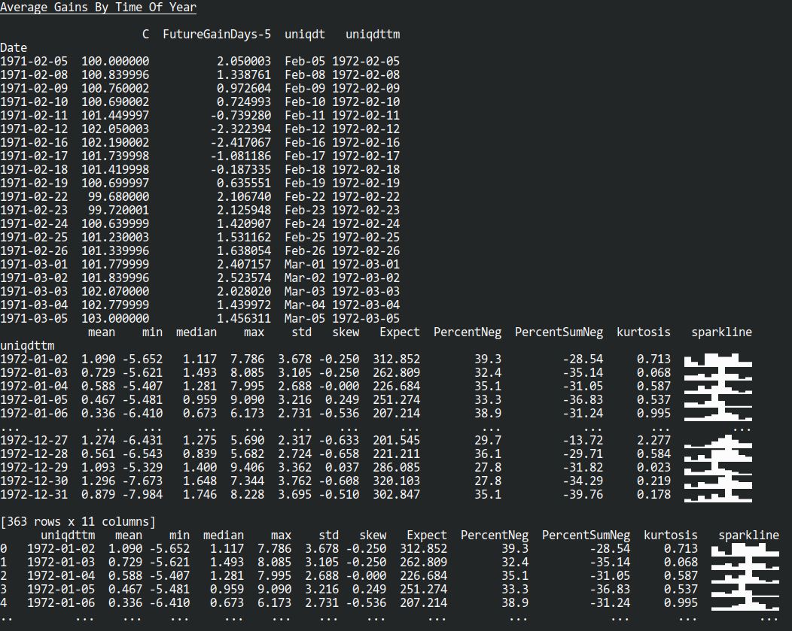
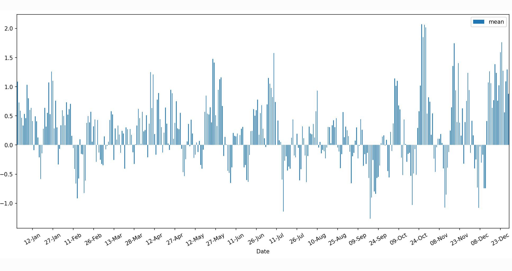

# AverageStockGainsByTimeOfYear

As an avid investor, it is often helpful to see seasonality in stocks and stock indices.

For example - on date X, historically what has this stock done - gone up or gone down.

This handy python utility will download any publically listed stock from Yahoo Finance, aggregate the data, and then look at the percentage gain in price for 5 trading days ahead.

## Usage:

In main.py:

- daysGain = look ahead trading days
- yahooSymbol = stock ticker in Yahoo ("^IXIC" used as default is Nasdaq 100)

A dataframe will show average gains, and some key stats for each of the yearly observations that make up the averaged gain per date : median, standard devation, skew and kurtosis. 

Also included is Expectancy (a financial measure of profitability) and the Percentage of observations which are negative per date.

A sparkline graph is also included to graphically show distribution of these results.

Plots are drawn for each of these results and stored locally.

